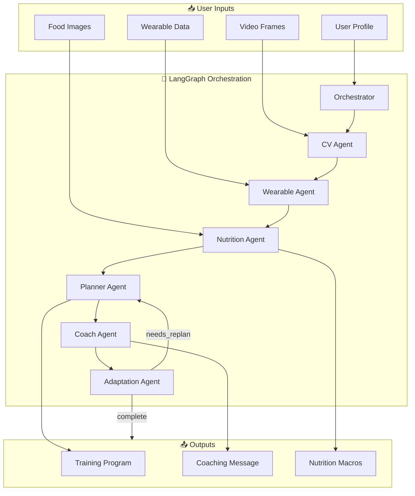
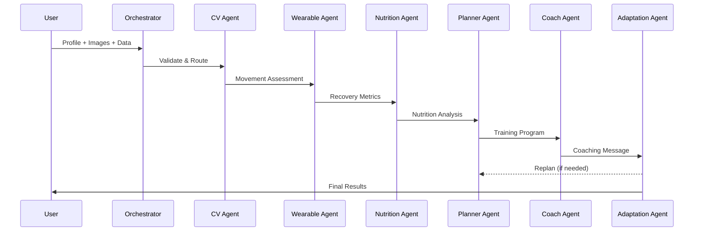

# AthletixAI - AI-Driven Virtual Fitness Coach

<div align="center">


**A multi-agent AI fitness coaching system using LangGraph for orchestration and OpenAI for intelligence.**

[Features](#-features) • [Architecture](#-architecture) • [Installation](#-installation) • [Documentation](#-documentation)

</div>

---

## 🎯 Overview

AthletixAI is an intelligent fitness coaching platform that combines:

- **Computer Vision** for exercise form analysis
- **Nutrition AI** for food image macro calculation
- **Wearable Integration** for recovery monitoring
- **Adaptive Training** for personalized workout programs

## ✨ Features

| Feature                      | Description                                                  |
| ---------------------------- | ------------------------------------------------------------ |
| 🍎 **Nutrition Analysis**    | Photograph meals → Get protein, carbs, fats, fiber, calories |
| 🏋️ **5-Day Programs**        | Comprehensive Push/Pull/Legs split with 13-15 exercises/day  |
| 🧘 **Warmup & Stretching**   | Built-in dynamic warmups and static cooldowns                |
| 📊 **Recovery Tracking**     | HRV, sleep, and activity analysis for training readiness     |
| 🎯 **Form Analysis**         | Video frame analysis for movement quality                    |
| 🔄 **Adaptive Optimization** | Automatic program adjustments based on feedback              |

---

## 🏗️ Architecture

### System Overview



### Agent Pipeline



---

## 🚀 Installation

```bash
# Clone the repository
git clone https://github.com/pankajshakya627/AthletixAI.git
cd AthletixAI

# Install dependencies
pip install -e ".[dev]"

# Configure environment
cp .env.example .env
# Add your OPENAI_API_KEY to .env
```

## 📖 Usage

### Interactive Mode (Recommended)

```bash
python -m src.main --program-only
# Choose: 1=Sample, 2=Create new profile, 3=Specify file
```

### Nutrition Analysis Only

```bash
python -m src.main --nutrition-only --food-images meal.jpg
```

### Full Mode

```bash
python -m src.main --profile user.json --food-images meal.jpg
```

---

## 📁 Project Structure

```
AthletixAI/
├── docs/
│   ├── HLD.md              # High-Level Design
│   └── LLD.md              # Low-Level Design
├── src/
│   ├── main.py             # CLI entry point
│   ├── graph.py            # LangGraph topology
│   ├── state.py            # FitnessState TypedDict
│   ├── agents/             # 7 specialized agents
│   ├── models/             # Pydantic data models
│   ├── memory/             # Session & persistence
│   ├── safety/             # Guardrails & validators
│   └── utils/              # OpenAI client & prompts
├── tests/
├── pyproject.toml
└── sample_user.json
```

## 📚 Documentation

| Document              | Description                                                    |
| --------------------- | -------------------------------------------------------------- |
| [HLD.md](docs/HLD.md) | High-Level Design - System architecture, components, data flow |
| [LLD.md](docs/LLD.md) | Low-Level Design - Classes, methods, algorithms, APIs          |

## 🔒 Safety

- Input validation (age, weight, height ranges)
- Weekly volume caps per muscle group
- Injury-aware exercise modifications
- Conservative progression (max 10%/week)
- Automatic health disclaimers

## 🛠️ Tech Stack

| Category        | Technology                   |
| --------------- | ---------------------------- |
| Orchestration   | LangGraph (StateGraph)       |
| AI              | OpenAI GPT-4o, GPT-4o Vision |
| Data Validation | Pydantic v2                  |
| Persistence     | SQLite                       |
| Testing         | pytest                       |

## 📝 License

MIT License

---

<div align="center">
Made with 💪 by AthletixAI Team
</div>
