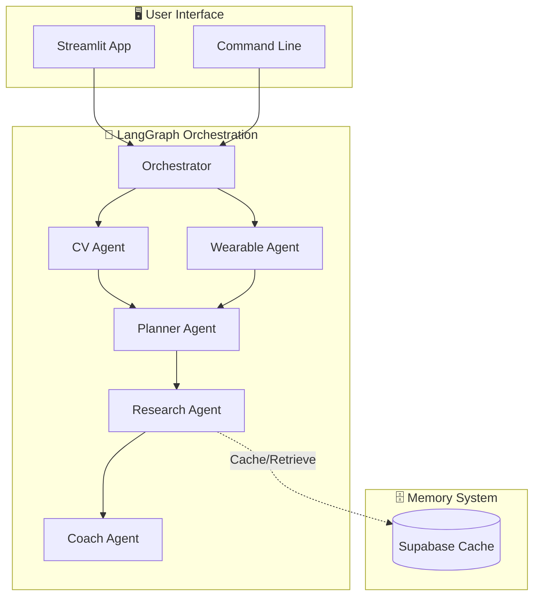

# AthletixAI - AI-Driven Virtual Fitness Coach

<div align="center">


**A multi-agent AI fitness coaching system using LangGraph for orchestration and OpenAI for intelligence.**

[Features](#-features) • [Architecture](#-architecture) • [Installation](#-installation) • [Documentation](#-documentation)

</div>

---

## 🎯 Overview

AthletixAI is an intelligent fitness coaching platform that combines:

- **Computer Vision** for exercise form analysis
- **Nutrition AI** for food image macro calculation
- **Wearable Integration** for recovery monitoring
- **Adaptive Training** for personalized workout programs

## ✨ Features

| Feature                      | Description                                                                                     |
| ---------------------------- | ----------------------------------------------------------------------------------------------- |
| 🍎 **Nutrition Analysis**    | Photograph meals → Get protein, carbs, fats, fiber, calories                                    |
| 🏋️ **5-Day Programs**        | Comprehensive Push/Pull/Legs split with 15-20 exercises/day                                     |
| 🧘 **Warmup & Stretching**   | Built-in dynamic warmups and static cooldowns                                                   |
| 📊 **Recovery Tracking**     | HRV, sleep, and activity analysis for training readiness                                        |
| 🎯 **Form Analysis**         | Video frame analysis for movement quality                                                       |
| 🔄 **Adaptive Optimization** | Automatic program adjustments based on feedback                                                 |
| 🔍 **Exercise Research**     | Auto-search for tutorials, videos, GIFs for every exercise                                      |
| 🗄️ **Long-term Memory**      | Supabase storage for user profiles, programs, workout history                                   |
| 🖥️ **Interactive Web UI**    | Streamlit dashboard for **interactive profile creation**, management, and workout visualization |
| 📚 **Rich Resources**        | Clickable Tutorial, Video, and GIF links for every exercise                                     |

---

## 🏗️ Architecture

### System Overview



### Agent Pipeline

1.  **User Profile**: Inputs from UI or JSON.
2.  **Planner**: Generates 5-6 day workout program based on experience (Intermediate/Advanced).
3.  **Research**: Searches web (Tavily) for tutorial videos/articles for every exercise.
4.  **Coach**: Adds personalized advice and motivation.
5.  **Output**: Interactive table with clickable video links.

---

## 📸 Screenshots

> _Run the app to see the interactive dashboard!_

|                      **Profile Creation**                      |                       **Workout Dashboard**                       |
| :------------------------------------------------------------: | :---------------------------------------------------------------: |
|          Create/Edit profiles directly in the sidebar          |             View clear, resource-rich workout tables              |
|  |  |

---

## 🚀 Installation

```bash
# Clone the repository
git clone https://github.com/pankajshakya627/AthletixAI.git
cd AthletixAI

# Create virtual environment
python -m venv venv
source venv/bin/activate  # On Windows: venv\Scripts\activate

# Install dependencies
pip install -e ".[dev]"
pip install streamlit

# Configure environment
cp .env.example .env
# Edit .env and add your API keys:
# - OPENAI_API_KEY (required)
# - TAVILY_API_KEY (optional, for exercise research)
# - SUPABASE_URL/KEY (optional, for caching)
```

## 📖 Usage

### 🖥️ Interactive Web UI (Recommended)

The easiest way to use the coach is via the Streamlit app:

```bash
streamlit run src/app.py
```

**Features:**

- **Create Profile**: Enter your details directly in the side bar.
- **Generate Program**: One-click generation of personalized plans.
- **Rich Workout Tables**: View daily workouts with dedicated columns for **Tutorials**, **Videos**, and **Visuals**.
- **Schedule**: Visual weekly calendar.

### 💻 Command Line Interface

```bash
# Run program generation for a specific profile
python -m src.main --program-only --profile sample_user.json
```

---

## 📁 Project Structure

```
AthletixAI/
├── docs/
│   ├── HLD.md                  # High-Level Design
│   ├── LLD.md                  # Low-Level Design
│   └── SUPABASE_SETUP.md       # Database setup guide
├── migrations/
│   └── 001_initial_schema.sql  # Supabase database schema
├── src/
│   ├── app.py                  # Streamlit Web UI
│   ├── main.py                 # CLI entry point
│   ├── graph.py                # LangGraph topology
│   ├── state.py                # FitnessState TypedDict
│   ├── agents/                 # 8 specialized agents
│   │   ├── research_agent.py   # Exercise resource search
│   │   └── ...                 # Other agents
│   ├── models/                 # Pydantic data models
│   │   ├── research.py         # Exercise resources
│   │   ├── session.py          # Session tracking
│   │   └── ...
│   ├── memory/                 # Memory system
│   │   ├── user_memory.py      # Supabase integration
│   │   └── session_cache.py    # In-memory cache
│   ├── safety/                 # Guardrails & validators
│   └── utils/                  # OpenAI client & prompts
├── tests/
│   ├── test_supabase_setup.py
│   └── test_research_integration.py
├── pyproject.toml
└── sample_user.json
```

## 📚 Documentation

| Document                                    | Description                                             |
| ------------------------------------------- | ------------------------------------------------------- |
| [HLD.md](docs/HLD.md)                       | High-Level Design - Architecture, components, data flow |
| [LLD.md](docs/LLD.md)                       | Low-Level Design - Classes, methods, algorithms, APIs   |
| [SUPABASE_SETUP.md](docs/SUPABASE_SETUP.md) | Supabase database setup and configuration guide         |

## 🔒 Safety

- Input validation (age, weight, height ranges)
- Weekly volume caps per muscle group
- Injury-aware exercise modifications
- Conservative progression (max 10%/week)
- Automatic health disclaimers

## 🛠️ Tech Stack

| Category        | Technology                    |
| --------------- | ----------------------------- |
| Orchestration   | LangGraph (StateGraph)        |
| AI              | OpenAI GPT-4o, GPT-4o Vision  |
| Data Validation | Pydantic v2                   |
| Database        | Supabase (PostgreSQL)         |
| Search          | Tavily API                    |
| Memory          | LangGraph Checkpoints, SQLite |
| Persistence     | SQLite                        |
| Frontend        | Streamlit                     |
| Testing         | pytest                        |

## 📝 License

MIT License

---

<div align="center">
Made with 💪 by AthletixAI Team
</div>
