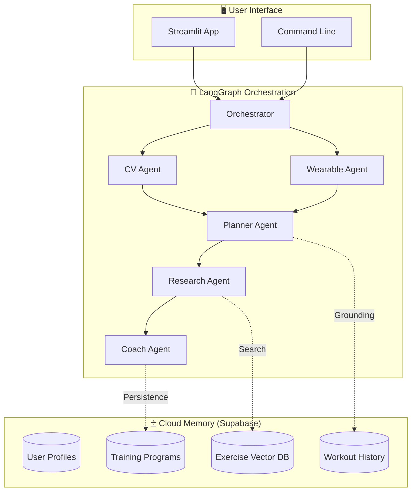

# AthletixAI - AI-Driven Virtual Fitness Coach

<div align="center">


**A multi-agent AI fitness coaching system using LangGraph for orchestration and Supabase for long-term memory.**

[Features](#-features) • [Architecture](#-architecture) • [Installation](#-installation) • [Database Setup](#-database-setup) • [Documentation](#-documentation)

</div>

---

## 🎯 Overview

AthletixAI is an intelligent fitness coaching platform that combines:

- **Computer Vision** for exercise form analysis
- **Nutrition AI** for food image macro calculation
- **Long-Term Memory** for cross-session personalized training
- **Semantic Search** for intelligent exercise discovery and substitution

## ✨ Features

| Feature                    | Description                                                                                   |
| -------------------------- | --------------------------------------------------------------------------------------------- |
| 🗄️ **Long-term Memory**    | Supabase storage for user profiles, programs, workout history, and cross-session learning.    |
| 🔍 **Semantic Search**     | Intelligence exercise discovery using **pgvector**. Find "leg exercises" or "core stability". |
| 🍎 **Nutrition Analysis**  | Photograph meals → Get protein, carbs, fats, fiber, calories.                                 |
| 🏋️ **Adaptive Programs**   | Programs adjust based on your history and experience level (Beginner/Intermediate/Advanced).  |
| 🧘 **Warmup & Stretching** | Built-in dynamic warmups and static cooldowns tailored to your daily plan.                    |
| 📊 **Recovery Tracking**   | HRV, sleep, and activity analysis for training readiness.                                     |
| 🖥️ **Interactive Web UI**  | Streamlit dashboard with **Cloud Sync Active** indicators and profile management.             |
| 📚 **Rich Resources**      | Clickable Tutorial, Video, and GIF links for every exercise.                                  |

---

## 🏗️ Architecture

### System Overview



### Agent Pipeline

1.  **User Profile**: Inputs from UI or JSON.
2.  **Planner**: Generates 5-6 day workout program based on experience (Intermediate/Advanced).
3.  **Research**: Searches web (Tavily) for tutorial videos/articles for every exercise.
4.  **Coach**: Adds personalized advice and motivation.
5.  **Output**: Interactive table with clickable video links.

---

## 📸 Screenshots

> _Run the app to see the interactive dashboard!_

|                      **Profile Creation**                      |                       **Workout Dashboard**                       |
| :------------------------------------------------------------: | :---------------------------------------------------------------: |
|          Create/Edit profiles directly in the sidebar          |             View clear, resource-rich workout tables              |
|  |  |

---

## 🚀 Installation

```bash
# Clone the repository
git clone https://github.com/pankajshakya627/AthletixAI.git
cd AthletixAI

# Create virtual environment
python -m venv venv
source venv/bin/activate  # On Windows: venv\Scripts\activate

# Install dependencies
pip install -e ".[dev]"
pip install streamlit supabase tqdm

# Configure environment
cp .env.example .env
# Edit .env and add your API keys:
# - OPENAI_API_KEY (required)
# - TAVILY_API_KEY (optional, for exercise research)
# - SUPABASE_URL/KEY (optional, for caching)
```

## 🗄️ Database Setup (Supabase)

AthletixAI requires **Supabase** for its core intelligence and long-term memory.

### 1. Configure Environment

Add your credentials to `.env`:

```env
SUPABASE_URL=your_project_url
SUPABASE_KEY=your_service_role_key
OPENAI_API_KEY=your_key
```

### 2. Apply Migrations

Run these SQL scripts in order in your **Supabase SQL Editor**:

1.  [001_initial_schema.sql](migrations/001_initial_schema.sql) - Core tables.
2.  [002_add_difficulty.sql](migrations/002_add_difficulty.sql) - Exercise metadata.
3.  [003_semantic_search.sql](migrations/003_semantic_search.sql) - **CRITICAL**: Enables `pgvector` and semantic search.

### 3. Seed Vector Database

Once migrations are complete and API keys are set, populate the exercise library:

```bash
python scripts/seed_exercises_vector.py
```

_This generates OpenAI embeddings for 100+ exercises and saves them to your cloud database._

---

## 📖 Usage

### 🖥️ Interactive Web UI (Recommended)

The easiest way to use the coach is via the Streamlit app:

```bash
streamlit run src/app.py
```

**Features:**

- **Cloud Sync Active**: Real-time indicator of Supabase connectivity.
- **Historical Grounding**: Automatically adjusts your new program based on your last 5 workouts.
- **Rich Dashboard**: View weekly schedules with embedded exercise tutorials.

### 💻 Command Line Interface

```bash
# Run program generation for a specific profile
python -m src.main --program-only --profile sample_user.json
```

---

## 📁 Project Structure

```
AthletixAI/
├── docs/
│   ├── HLD.md                  # High-Level Design
│   ├── LLD.md                  # Low-Level Design
│   └── SUPABASE_SETUP.md       # Database setup guide
├── migrations/
│   └── 001_initial_schema.sql  # Supabase database schema
├── src/
│   ├── app.py                  # Streamlit Web UI
│   ├── main.py                 # CLI entry point
│   ├── graph.py                # LangGraph topology
│   ├── state.py                # FitnessState TypedDict
│   ├── agents/                 # 8 specialized agents
│   │   ├── research_agent.py   # Exercise resource search
│   │   └── ...                 # Other agents
│   ├── models/                 # Pydantic data models
│   │   ├── research.py         # Exercise resources
│   │   ├── session.py          # Session tracking
│   │   └── ...
│   ├── memory/                 # Memory system
│   │   ├── user_memory.py      # Supabase integration
│   │   └── session_cache.py    # In-memory cache
│   ├── safety/                 # Guardrails & validators
│   └── utils/                  # OpenAI client & prompts
├── tests/
│   ├── test_supabase_setup.py
│   └── test_research_integration.py
├── pyproject.toml
└── sample_user.json
```

## 📚 Documentation

| Document                                           | Description                                           |
| -------------------------------------------------- | ----------------------------------------------------- |
| [Enterprise_HLD.md](docs/Enterprise_HLD.md)        | **New** Enterprise Design Thinking Framework HLD      |
| [SUPABASE_SETUP.md](docs/SUPABASE_SETUP.md)        | Detailed database configuration guide                 |
| [Interview_Preparation.md](docs/Enterprise_HLD.md) | Structured Q&A for the Enterprise Design architecture |

## 🔒 Safety

- Input validation (age, weight, height ranges)
- Weekly volume caps per muscle group
- Injury-aware exercise modifications
- Conservative progression (max 10%/week)
- Automatic health disclaimers

## 🛠️ Tech Stack

| Category      | Technology                       |
| ------------- | -------------------------------- |
| Orchestration | LangGraph (StateGraph)           |
| AI            | OpenAI GPT-4o, text-embedding-3  |
| Database      | Supabase (PostgreSQL + pgvector) |
| Vector Store  | HNSW Index on Supabase           |
| Frontend      | Streamlit                        |
| Search        | Tavily API                       |

## 📝 License

MIT License

---

<div align="center">
Made with 💪 by AthletixAI Team
</div>
