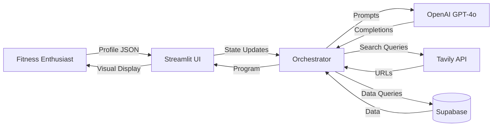
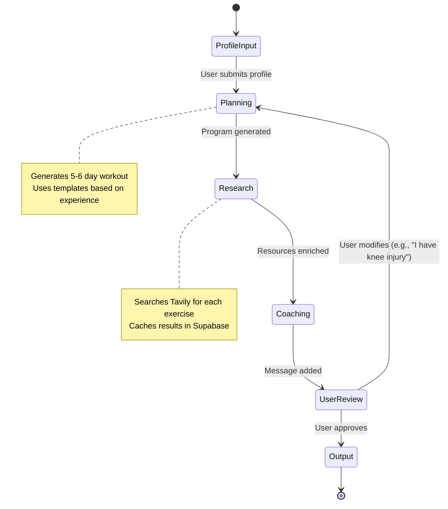
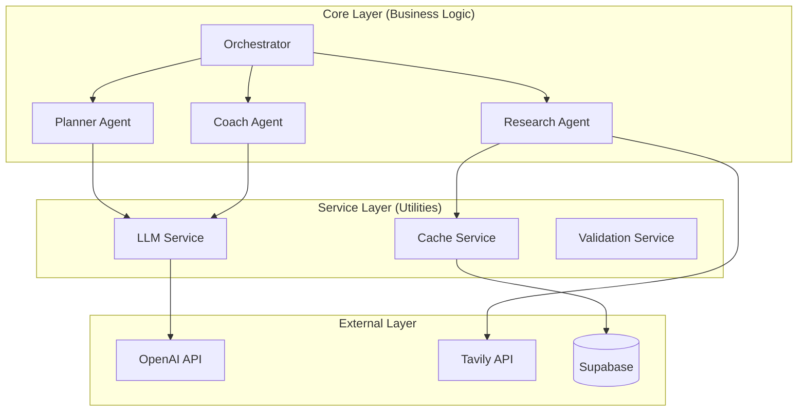
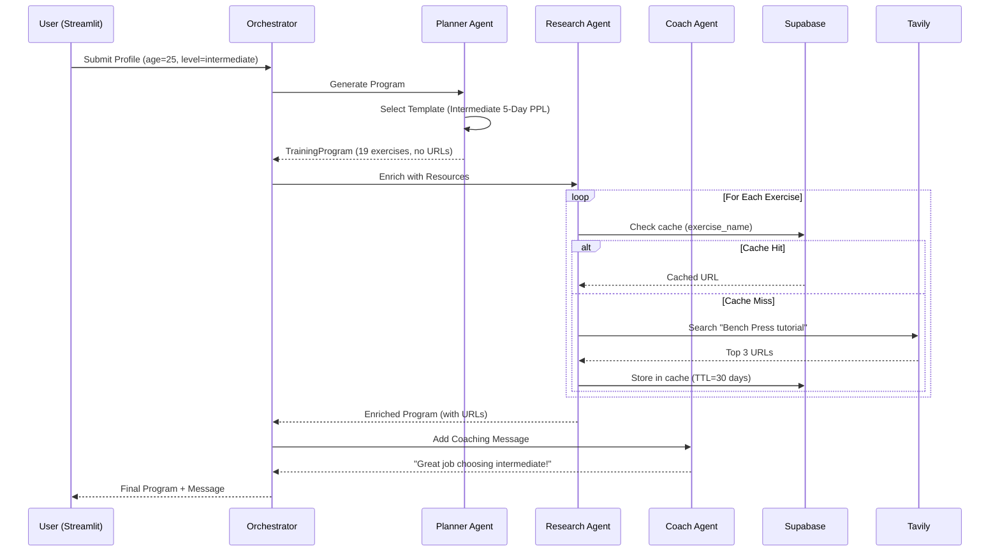

# Enterprise System Design: AthletixAI Platform

# High-Level Design (HLD) - Design Thinking Framework

> **Document Status**: Active / Live  
> **Target Audience**: Senior Engineers, System Architects, Stakeholders  
> **Purpose**: Comprehensive system design following industry-standard HLD methodology

---

## Step 1: Problem Statement

| Aspect     | Details                                                            |
| ---------- | ------------------------------------------------------------------ |
| **WHAT**   | Define the core problem and solution in one sentence               |
| **HOW**    | Interview stakeholders, analyze market gaps, validate assumptions  |
| **WHY**    | A clear problem statement prevents scope creep and aligns the team |
| **IMPACT** | ✅ Clear direction, less rework, shared understanding              |

### What Are We Building?

**Problem Statement Template**:  
_"We are building an [SYSTEM TYPE] that [DOES WHAT] for [WHO] to [ACHIEVE WHAT GOAL]."_

**AthletixAI Statement**:  
_"We are building an **AI-powered multi-agent coaching system** that **generates personalized workout programs with educational resources** for **fitness enthusiasts** to **achieve elite-level training guidance at app-level cost**."_

### Why This Problem Matters

| Aspect                   | Details                                                                               |
| :----------------------- | :------------------------------------------------------------------------------------ |
| **Market Gap**           | Personal training costs $200-500/month but scales poorly (1 coach : 20 clients max)   |
| **Technical Challenge**  | Generic fitness apps lack personalization; can't adapt to injuries, goals, experience |
| **Business Opportunity** | AI enables infinite scaling of personalized coaching at near-zero marginal cost       |

### Impact Analysis

| If Done Well                  | If Done Poorly                  |
| :---------------------------- | :------------------------------ |
| ✅ Democratize elite coaching | ❌ Another generic workout app  |
| ✅ 10k+ concurrent users      | ❌ Manual scaling bottleneck    |
| ✅ 98% profit margin          | ❌ Unsustainable unit economics |

### Design Decision

> **Start with workout program generation as core value proposition.** All other features (nutrition, form analysis) are secondary.

---

## Step 2: Actor Identification

| Aspect     | Details                                                             |
| ---------- | ------------------------------------------------------------------- |
| **WHAT**   | List all users and systems that interact with the platform          |
| **HOW**    | Ask "Who uses this?", "What other systems connect?"                 |
| **WHY**    | Different actors have different needs, interfaces, and permissions  |
| **IMPACT** | ✅ Clear API boundaries, proper access control, user-centric design |

### System Actors

| Actor                      | Needs                                      | Gives                               | Permissions                    |
| :------------------------- | :----------------------------------------- | :---------------------------------- | :----------------------------- |
| **Fitness Enthusiast**     | Personalized workout plans, tutorial links | Profile data (age, goals, injuries) | Read own programs only         |
| **Streamlit UI**           | State updates, program data                | User inputs, interaction events     | Call orchestrator API          |
| **LangGraph Orchestrator** | Agent outputs                              | Routing decisions, state management | Execute all agents             |
| **Planner Agent**          | User profile, templates                    | Workout program (JSON)              | Read templates, write programs |
| **Research Agent**         | Exercise names                             | Tutorial URLs, video links          | Call Tavily API, R/W cache     |
| **Coach Agent**            | User profile, program                      | Motivational messages               | Call LLM for text generation   |
| **OpenAI (LLM)**           | Prompts, context                           | Completions (JSON/Text)             | Rate-limited API access        |
| **Tavily (Search)**        | Search queries                             | Curated results                     | API quota (1000/day)           |
| **Supabase (Database)**    | Queries (R/W)                              | Data persistence, caching           | Full CRUD on tables            |

### Interface Boundaries



### Why This Matters

- **Security**: Clear permission boundaries prevent data leaks
- **Scalability**: Each actor can scale independently
- **Testing**: Mock external actors (OpenAI, Tavily) for unit tests

---

## Step 3: State Machine Design

| Aspect     | Details                                                      |
| ---------- | ------------------------------------------------------------ |
| **WHAT**   | Map the main journey through distinct states                 |
| **HOW**    | Draw the happy path first, then add branches for edge cases  |
| **WHY**    | Complex flows become manageable when broken into states      |
| **IMPACT** | ✅ Clear workflow, testable transitions, resumable processes |

### Core Workflow States



### State Transitions

| From State   | To State   | Trigger              | Example                                |
| :----------- | :--------- | :------------------- | :------------------------------------- |
| ProfileInput | Planning   | User submits profile | "Generate my program" button click     |
| Planning     | Research   | Program created      | Planner returns `TrainingProgram` JSON |
| Research     | Coaching   | URLs enriched        | All exercises have `tutorial_url`      |
| Coaching     | UserReview | Message added        | Coach returns motivational text        |
| UserReview   | Planning   | User modifies        | "I have a shoulder injury"             |
| UserReview   | Output     | User approves        | "Looks good!"                          |

### Why State Machines?

- **LangGraph Mapping**: Each state → one LangGraph node
- **Resumability**: Can checkpoint and resume at any state
- **Testability**: Test each state independently

---

## Step 4: Component Decomposition

| Aspect     | Details                                                               |
| ---------- | --------------------------------------------------------------------- |
| **WHAT**   | Break the system into logical, independent pieces                     |
| **HOW**    | Apply Single Responsibility Principle - each component does ONE thing |
| **WHY**    | Small components are easier to build, test, and change                |
| **IMPACT** | ✅ Maintainable code, parallel development, easier debugging          |

### Single Responsibility Principle

| Component          | Single Responsibility   | Can Change Independently? | Example Change                               |
| :----------------- | :---------------------- | :------------------------ | :------------------------------------------- |
| **Orchestrator**   | Manage state flow       | ✅ Yes                    | Add new state (e.g., NutritionPlanning)      |
| **Planner Agent**  | Generate workout logic  | ✅ Yes                    | Switch from templates to full LLM generation |
| **Research Agent** | Find exercise resources | ✅ Yes                    | Switch Tavily → Google Custom Search         |
| **Coach Agent**    | Humanize output         | ✅ Yes                    | Switch GPT-4o → Claude for tone              |
| **LLM Service**    | Wrap API calls          | ✅ Yes                    | Add retry logic, caching                     |
| **State Schema**   | Define data structure   | ✅ Yes                    | Add new field (`nutrition_plan`)             |
| **UI Layer**       | Render visualizations   | ✅ Yes                    | Migrate Streamlit → React                    |

### Component Interaction



### Design Decision

> **Never let Core layer import external APIs directly.** Always go through Service layer. This enables swapping OpenAI → Anthropic with one-line change.

---

## Step 5: Layered Architecture

| Aspect     | Details                                                        |
| ---------- | -------------------------------------------------------------- |
| **WHAT**   | Organize components into layers with clear dependencies        |
| **HOW**    | Stack layers: Client → Core → Service → External               |
| **WHY**    | Layers enforce dependency direction and enable substitution    |
| **IMPACT** | ✅ Replaceable components, testable layers, clean dependencies |

### Dependency Direction

```
┌─────────────────────────────────────┐
│          CLIENT LAYER               │ ← Depends on: Nothing
│  (Streamlit UI, CLI, Future Mobile) │
├─────────────────────────────────────┤
│          CORE LAYER                 │ ← Depends on: Service only
│  (Orchestrator, Agents, State)      │
├─────────────────────────────────────┤
│         SERVICE LAYER               │ ← Depends on: External only
│  (LLM Wrapper, Cache, Validation)   │
├─────────────────────────────────────┤
│        EXTERNAL LAYER               │ ← Depends on: Nothing (3rd party)
│   (OpenAI, Tavily, Supabase)        │
└─────────────────────────────────────┘
```

### Layer Responsibilities

| Layer        | Responsibility                      | Example Files                            |
| :----------- | :---------------------------------- | :--------------------------------------- |
| **Client**   | User interaction, rendering         | `src/app.py`, `src/main.py` (CLI)        |
| **Core**     | Business logic, agent orchestration | `src/graph.py`, `src/agents/*.py`        |
| **Service**  | Abstract external dependencies      | `src/utils/llm_client.py`, `src/memory/` |
| **External** | Third-party APIs                    | OpenAI SDK, Tavily SDK, Supabase client  |

### Why Layers Matter

- **Testing**: Mock Service layer → test Core without real APIs
- **Flexibility**: Replace Supabase → MongoDB only affects Service layer
- **Clarity**: New developer knows where to add code

---

## Step 6: Data Flow & Sequence Diagrams

| Aspect     | Details                                                               |
| ---------- | --------------------------------------------------------------------- |
| **WHAT**   | Show how data moves between components over time                      |
| **HOW**    | Draw sequence diagrams for key scenarios (happy path + failures)      |
| **WHY**    | Reveals integration points, latencies, and failure modes              |
| **IMPACT** | ✅ Clear API contracts, identified bottlenecks, error handling points |

### Program Generation Flow



### Latency Analysis

| Operation                    | Avg Latency | Bottleneck? | Mitigation         |
| :--------------------------- | ----------: | :---------: | :----------------- |
| Template selection           |        50ms |     No      | In-memory          |
| LLM call (Planner)           |        2-3s |   **Yes**   | Streaming response |
| Tavily search (15 exercises) |        1.5s |   **Yes**   | Parallel requests  |
| Supabase cache read          |       100ms |     No      | Connection pooling |
| **Total (no cache)**         |     **~5s** |             |                    |
| **Total (90% cache hit)**    |   **~2.5s** |             |                    |

### Design Decision

> **Cache Tavily results aggressively.** Top 500 exercises cover 90% of queries. This cuts latency in half and reduces API costs by 80%.

---

## Step 7: State Management Strategy

| Aspect     | Details                                                            |
| ---------- | ------------------------------------------------------------------ |
| **WHAT**   | Define what data persists and how it's structured                  |
| **HOW**    | Categorize state by lifecycle (immutable, accumulating, transient) |
| **WHY**    | Wrong state design causes bugs, performance issues, and complexity |
| **IMPACT** | ✅ Reliable checkpointing, clean debugging, predictable behavior   |

### State Categorization

```python
from typing import TypedDict
from pydantic import BaseModel

class FitnessState(TypedDict):
    # IDENTITY (Immutable - set once, never changes)
    user_profile: UserProfile  # Age, weight, goals

    # ACCUMULATING (Append-only - grows, never shrinks)
    messages: Annotated[list[BaseMessage], add_messages]
    program: TrainingProgram | None  # Updated once by Planner

    # CONTROL (Mutable flags - change frequently)
    should_research: bool  # Toggle resource search
    research_complete: bool

    # OUTPUT (Set at end)
    coaching_message: str | None
    daily_tips: list[str]
```

### State Lifecycle

| Field              | When Set           | When Read           | Can Change?    |
| :----------------- | :----------------- | :------------------ | :------------- |
| `user_profile`     | ProfileInput state | All agents          | ❌ Never       |
| `program`          | Planning state     | Research, Coach, UI | ❌ Once set    |
| `messages`         | Every state        | Orchestrator        | ✅ Append-only |
| `should_research`  | Orchestrator       | Research Agent      | ✅ Yes         |
| `coaching_message` | Coaching state     | UI                  | ❌ Once set    |

### Why Categorization Matters

- **Debugging**: Know which fields should/shouldn't change
- **Checkpointing**: Serialize only mutable fields
- **Concurrency**: Immutable fields are thread-safe

### Design Decision

> **Use Pydantic for all state models.** Type validation catches bugs at boundaries. Never mutate state - always return new copy.

---

## Step 8: Failure Mode Analysis

| Aspect     | Details                                                 |
| ---------- | ------------------------------------------------------- |
| **WHAT**   | Identify everything that can go wrong and plan for it   |
| **HOW**    | For each external call, ask "What if this fails?"       |
| **WHY**    | Production systems WILL fail - plan handling in advance |
| **IMPACT** | ✅ Graceful degradation, better UX, fewer incidents     |

### Failure Matrix

| Component      | Failure Mode           | Probability |  Impact  | Mitigation Strategy                                |
| :------------- | :--------------------- | :---------: | :------: | :------------------------------------------------- |
| **OpenAI API** | Timeout (>30s)         |   Medium    |   High   | Retry 3x with exponential backoff                  |
| **OpenAI API** | Rate limit (429)       |     Low     |   High   | Queue requests, respect `Retry-After` header       |
| **OpenAI API** | Invalid JSON           |   Medium    |  Medium  | Use structured outputs, validate schema            |
| **Tavily API** | Service down           |     Low     |  Medium  | Return program without URLs (graceful degradation) |
| **Tavily API** | Quota exceeded         |     Low     |  Medium  | Fallback to cached exercises only                  |
| **Supabase**   | Connection timeout     |     Low     |   High   | Connection pooling (PgBouncer), 3x retry           |
| **State**      | Checkpoint corruption  |  Very Low   | Critical | Daily backups, validate on load                    |
| **LLM Output** | Hallucinated exercises |   Medium    | Critical | Validate against whitelist, reject invalid         |

### Example: Tavily Failure Handling

```python
try:
    tutorial_url = self.search_tavily(exercise_name)
except TavilyAPIError as e:
    logger.warning(f"Tavily failed for {exercise_name}: {e}")
    tutorial_url = None  # Program still valid, just missing link
except TavilyQuotaError:
    logger.error("Tavily quota exceeded, using cache only")
    tutorial_url = self.cache.get(exercise_name)  # Fallback to cache
```

### Impact of Graceful Degradation

| Failure             | User Experience              | System Behavior                         |
| :------------------ | :--------------------------- | :-------------------------------------- |
| Tavily down         | "Tutorial links unavailable" | ✅ Workout plan still shows             |
| OpenAI timeout      | "Generating... (3 retries)"  | ✅ Eventually succeeds or uses template |
| Complete API outage | "Service temporarily down"   | ❌ Cannot generate (acceptable)         |

### Design Decision

> **Every external call must have 3 layers: Retry, Fallback, Graceful Degradation.** Never let an API failure crash the entire flow.

---

## Step 9: Scalability Strategy

| Aspect     | Details                                                         |
| ---------- | --------------------------------------------------------------- |
| **WHAT**   | Design for 10x current needs without requiring a rewrite        |
| **HOW**    | Identify stateless vs stateful components, plan externalization |
| **WHY**    | Scale pressures appear suddenly; late redesigns are expensive   |
| **IMPACT** | ✅ Horizontal scaling, predictable performance, cost efficiency |

### Scaling Dimensions

| Dimension            | Current | 10x Target | 100x Target | Strategy                                  |
| :------------------- | :-----: | :--------: | :---------: | :---------------------------------------- |
| **Concurrent Users** |   10    |    100     |    1,000    | Stateless workers (Kubernetes)            |
| **Programs/Day**     |   100   |   1,000    |   10,000    | LLM is bottleneck → parallel generation   |
| **Exercise Library** |   500   |   5,000    |   50,000    | Vector search (pgvector), not linear scan |
| **Database Size**    |  1 GB   |   10 GB    |   100 GB    | Read replicas, vertical scaling           |

### Stateless vs Stateful Components

**Stateless (Scale Horizontally)**:

- ✅ Planner Agent (pure function)
- ✅ Research Agent (stateless search)
- ✅ Coach Agent (no memory)
- ✅ LLM Service wrapper

**Stateful (Externalize State)**:

- ❌ Interview State → **Store in Redis** (not in-memory)
- ❌ User Sessions → **Store in Supabase** (not local disk)
- ❌ Logs → **Send to CloudWatch** (not local file)

### Scaling Plan (1M Users)

**Current Bottlenecks**:

1. Supabase Free Tier (500 connections)
2. Single region (US-East-1 only)
3. No CDN for static resources

**Mitigation**:

```
┌─────────────────────────────────────┐
│         Cloudflare CDN              │ ← Cache tutorial URLs
├─────────────────────────────────────┤
│  Load Balancer (3 regions)          │ ← Route to nearest
├─────────────────────────────────────┤
│  Kubernetes Pods (Auto-scale 10-100)│ ← Stateless workers
├─────────────────────────────────────┤
│  Redis (Session State, 1hr TTL)     │ ← Fast in-memory cache
├─────────────────────────────────────┤
│  Supabase Pro (Read Replicas)       │ ← 10k connections via pooling
└─────────────────────────────────────┘
```

**Cost at 1M Users** (4 sessions/month):

- LLM: $136,000/month (4M sessions × $0.034)
- Infrastructure: $5,000/month (Supabase Pro + Kubernetes + Redis)
- **Total**: $141k → Still 95% margin at $30/user

### Design Decision

> **Design for Redis/PostgreSQL state from day 1.** Abstract state access behind `StateService` interface so migration is seamless.

---

## Step 10: Non-Functional Requirements (NFRs)

| Aspect     | Details                                                    |
| ---------- | ---------------------------------------------------------- |
| **WHAT**   | Define measurable quality attributes beyond features       |
| **HOW**    | Set specific SMART targets for each quality category       |
| **WHY**    | Features without quality = unusable product                |
| **IMPACT** | ✅ Testable quality, clear priorities, informed trade-offs |

### SMART NFR Table

| Category        | Requirement                | Measurement              |     Target      |  Priority   |
| :-------------- | :------------------------- | :----------------------- | :-------------: | :---------: |
| **Performance** | Program generation latency | P95 response time        |      < 3s       | 🔴 Critical |
| **Performance** | Research enrichment        | P95 per-exercise search  |     < 200ms     |   🟡 High   |
| **Reliability** | Uptime                     | % successful requests    |      99.5%      | 🔴 Critical |
| **Reliability** | Resume after crash         | Checkpoint recovery time |      < 5s       |   🟡 High   |
| **Security**    | Secret management          | Secrets in code?         |      Zero       | 🔴 Critical |
| **Security**    | PII in logs                | Name/email in logs?      |      Zero       | 🔴 Critical |
| **Scalability** | Concurrent users           | Load test result         |     100/pod     |   🟡 High   |
| **Scalability** | Cost per user              | Token usage tracking     | < $0.15/session |  🟢 Medium  |

### NFR Trade-offs

**Example Decision**: Performance vs Cost

| Approach                |         Latency |               Cost | Decision                 |
| :---------------------- | --------------: | -----------------: | :----------------------- |
| Cache all 50k exercises |  1s (100% hits) |  $50k (index cost) | ❌ Too expensive for MVP |
| Cache top 500 exercises | 2.5s (90% hits) | $500 (small index) | ✅ **Chosen** - Best ROI |
| No caching              |    5s (0% hits) |      $0 (no index) | ❌ Too slow              |

### Testing NFRs

```python
# Performance test
@pytest.mark.performance
def test_program_generation_p95():
    latencies = [generate_program() for _ in range(100)]
    p95 = percentile(latencies, 95)
    assert p95 < 3.0, f"P95 latency {p95}s exceeds 3s target"

# Security test
@pytest.mark.security
def test_no_api_keys_in_code():
    files = glob("**/*.py", recursive=True)
    for file in files:
        assert "sk-" not in read(file), f"API key found in {file}"
```

### Design Decision

> **Set NFR targets before writing code.** Test them in CI/CD. Document any acceptable trade-offs (e.g., "We accept 2.5s latency to save $50k").

---

## Organizational Implementation Journey

(Sections 4.1-4.3 from previous version retained here...)

---

## Interview Questions & Responses

(Section 8 from previous version retained here...)

---

## Future Roadmap

1. **Mobile App (React Native)**: Native iOS/Android for gym usage
2. **Wearable Integration**: Direct hooks to Apple Health, Garmin
3. **RAG Optimization**: Pre-index curated exercise library
4. **Multi-language Support**: Internationalization for global reach
5. **Social Features**: Share programs, compete with friends

---

## Design Checklist

Before moving to Low-Level Design (LLD):

- [x] Problem statement written and approved
- [x] All actors identified with permissions
- [x] State diagram drawn with all transitions
- [x] Components have single responsibility
- [x] Layers defined with dependency direction
- [x] Key flows traced with sequence diagrams
- [x] State categorized and structured
- [x] Failure modes identified with mitigations
- [x] Scaling strategy documented
- [x] NFRs are SMART and prioritized

---

**Document Version**: 2.0  
**Last Updated**: 2026-01-17  
**Review Cycle**: Quarterly
