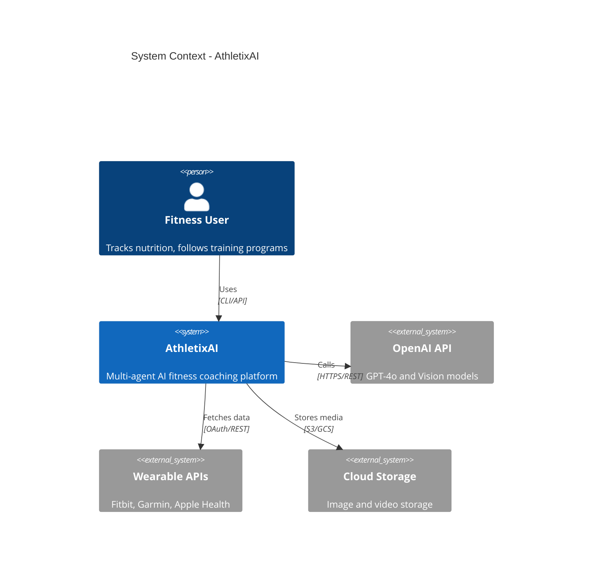
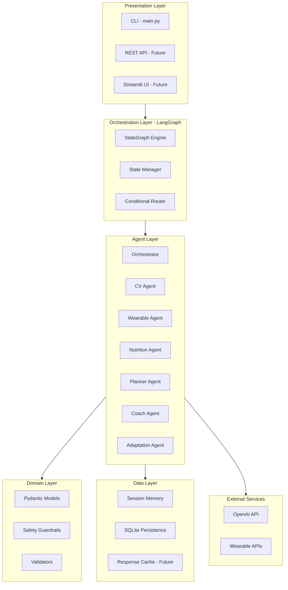
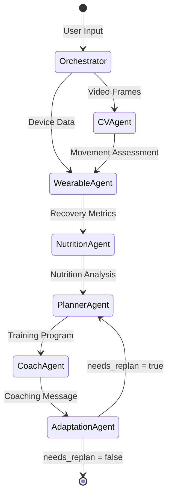
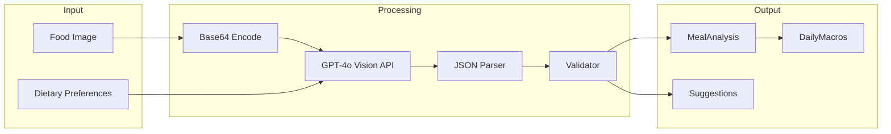
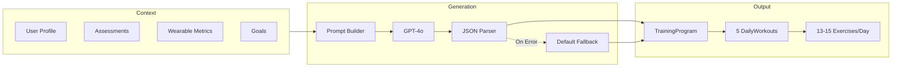
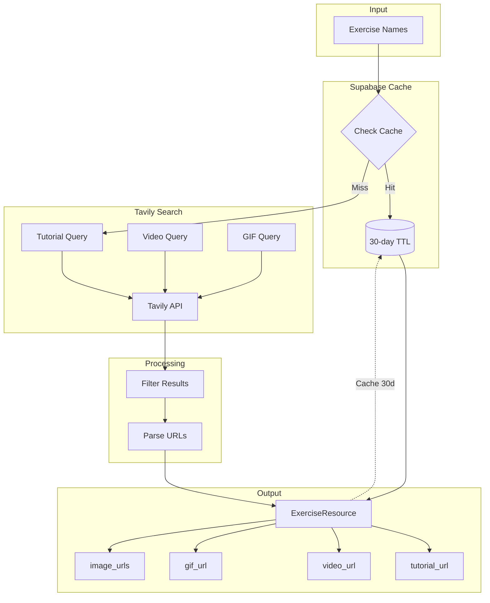
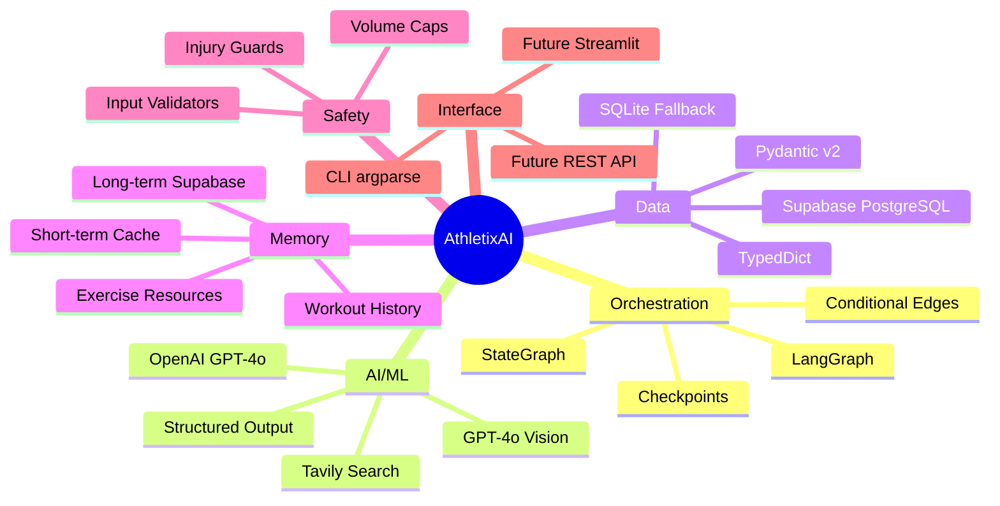
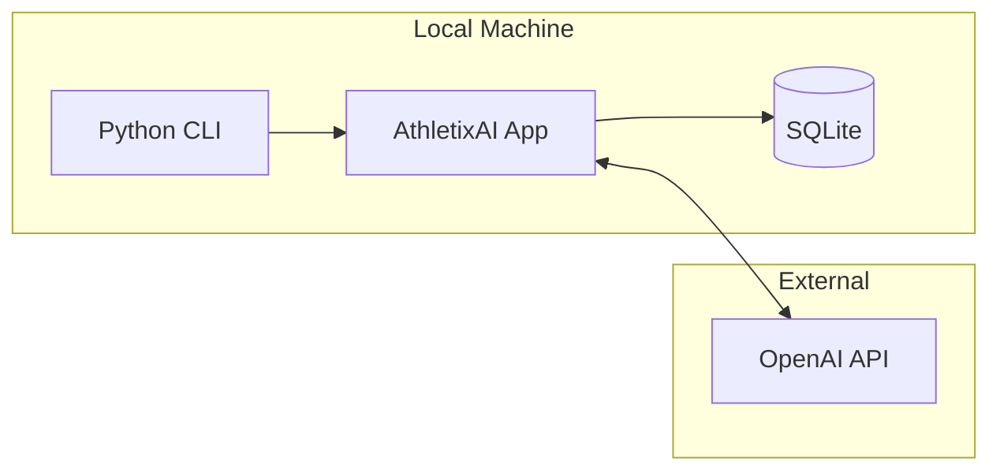
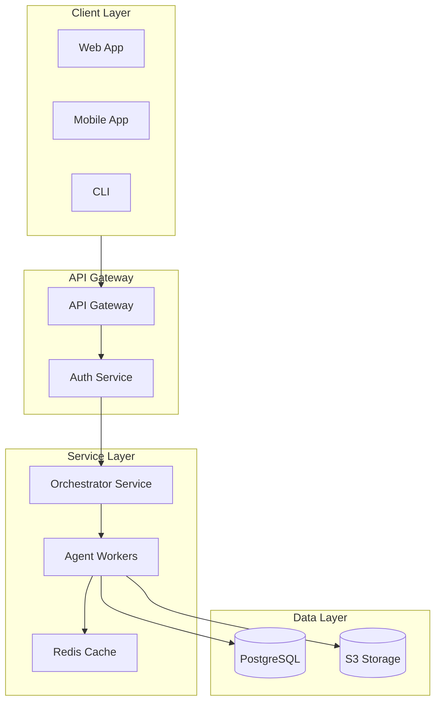

# High-Level Design (HLD) - AthletixAI

## 1. Executive Summary

**AthletixAI** is a multi-agent AI fitness coaching system that provides personalized training programs, nutrition analysis, and adaptive coaching using LangGraph orchestration and OpenAI GPT-4o.

| Attribute          | Value                                    |
| ------------------ | ---------------------------------------- |
| Architecture Style | Event-driven Multi-Agent System          |
| Orchestration      | LangGraph StateGraph                     |
| AI Provider        | OpenAI (GPT-4o, GPT-4o Vision), Tavily   |
| Data Store         | Supabase (PostgreSQL), SQLite (Fallback) |

---

## 2. System Context Diagram

---

## 3. High-Level Architecture

---

## 4. Agent Architecture

### 4.1 Agent Flow Diagram

### 4.2 Agent Specifications

| Agent              | Type          | LLM            | Responsibility                              |
| ------------------ | ------------- | -------------- | ------------------------------------------- |
| Orchestrator       | Deterministic | None           | Input validation, routing                   |
| CV Agent           | AI            | GPT-4o Vision  | Exercise form analysis                      |
| Wearable Agent     | AI            | GPT-4o         | Recovery metrics interpretation             |
| Nutrition Agent    | AI            | GPT-4o Vision  | Food → macro calculation                    |
| **Research Agent** | **AI**        | **Tavily API** | **Exercise tutorials, GIFs, videos search** |
| Planner Agent      | AI            | GPT-4o         | Training program generation                 |
| Coach Agent        | AI            | GPT-4o         | Human-like coaching messages                |
| Adaptation Agent   | Deterministic | None           | Feedback analysis, replan decision          |

---

## 5. Data Flow

### 5.1 Nutrition Analysis Pipeline

### 5.2 Program Generation Pipeline

### 5.3 Exercise Research Pipeline

---

## 6. Technology Stack

---

## 7. Deployment Architecture

### 7.1 Current (MVP)

### 7.2 Future (Production)

---

## 8. Security Considerations

| Concern          | Mitigation                        |
| ---------------- | --------------------------------- |
| API Key Exposure | Environment variables, .gitignore |
| PII Protection   | Local storage, no cloud logging   |
| Input Validation | Pydantic models, range checks     |
| Training Safety  | Volume caps, progression limits   |

---

## 9. Quality Attributes

| Attribute           | Approach                                    |
| ------------------- | ------------------------------------------- |
| **Reliability**     | Fallback to default programs on LLM failure |
| **Maintainability** | Modular agent architecture, type hints      |
| **Extensibility**   | New agents via add_node()                   |
| **Testability**     | Pure functions, dependency injection        |

---

## 10. References

- [LLD.md](LLD.md) - Low-Level Design
- [README.md](../README.md) - User Guide
