# Low-Level Design (LLD) - AthletixAI

## 1. Overview

This document provides detailed technical specifications including class diagrams, sequence diagrams, API contracts, and implementation algorithms.

---

## 2. Class Diagrams

### 2.1 Domain Models

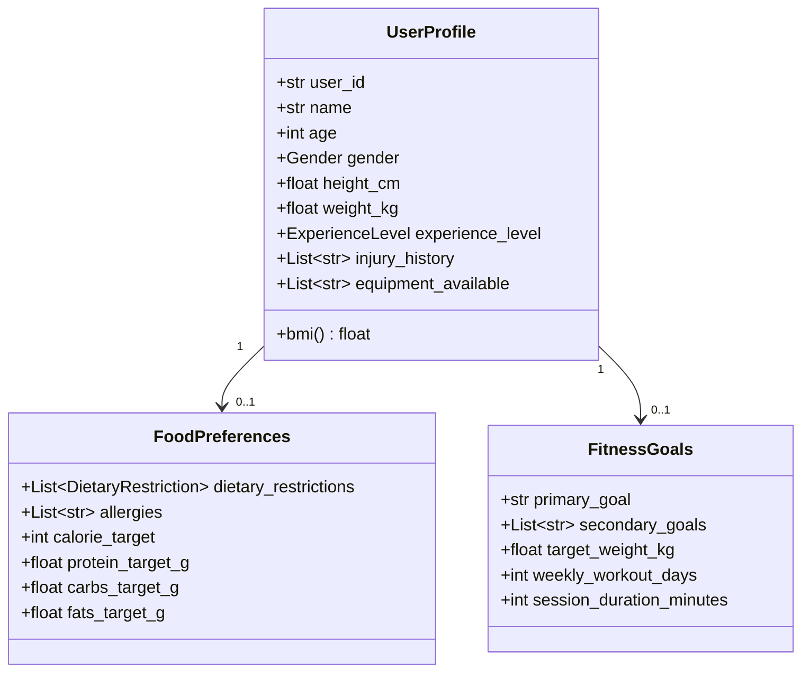

### 2.2 Nutrition Models

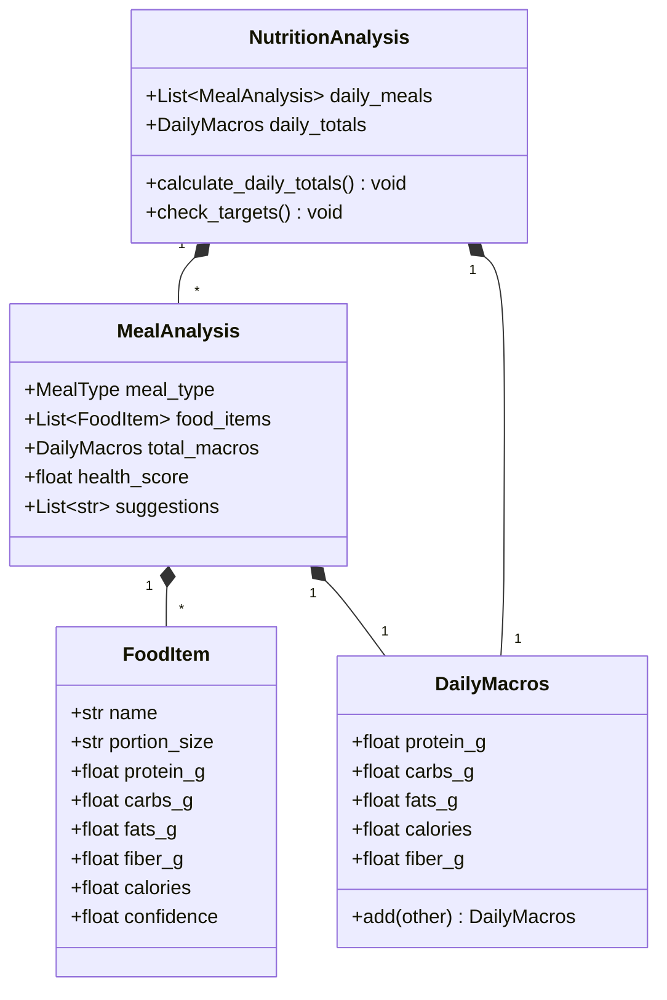

### 2.3 Training Program Models

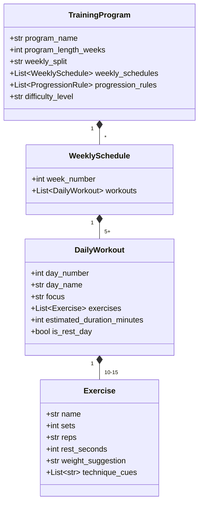

### 2.4 Research Models

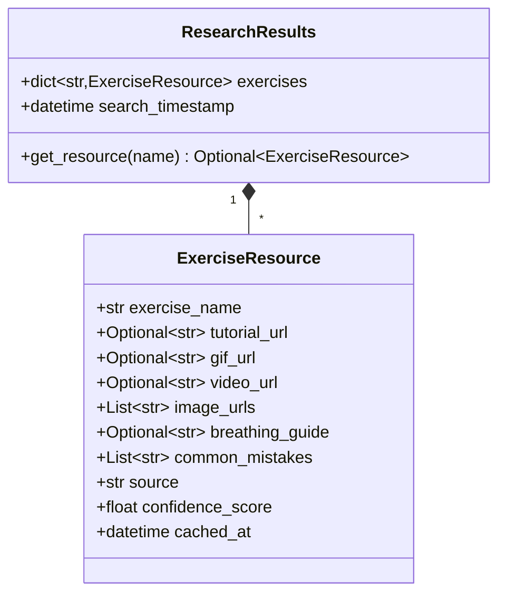

### 2.5 Memory Models

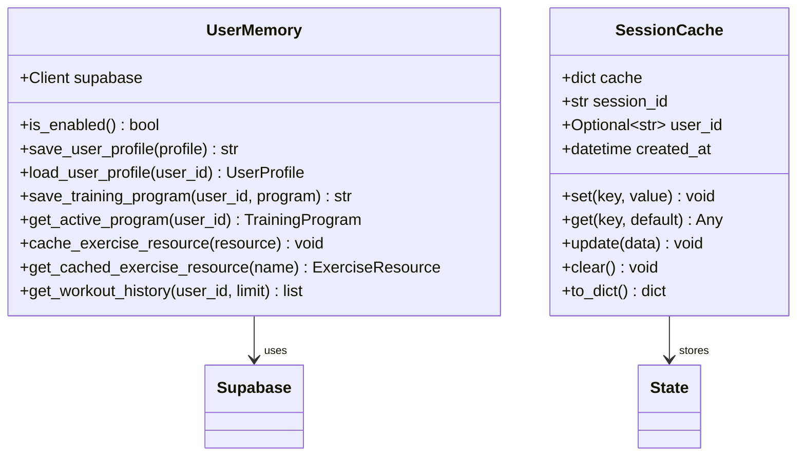

---

## 3. State Management

### 3.1 FitnessState Structure

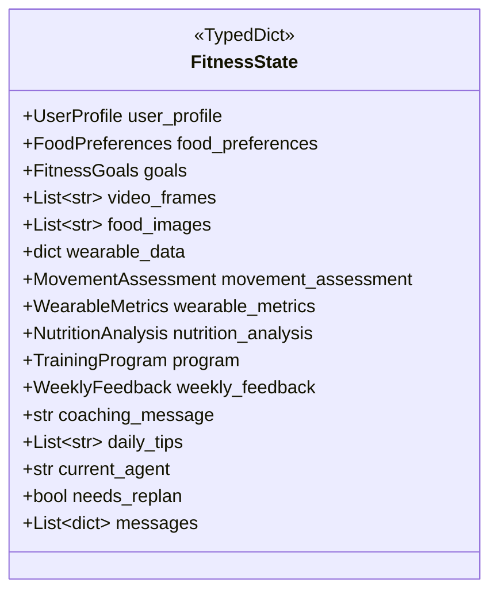

---

## 4. Agent Implementations

### 4.1 Agent Interface Pattern

````mermaid
classDiagram
    class AgentNode {
        <<interface>>
        +__call__(state: FitnessState) dict
    }

    class OrchestratorNode {
        +__call__(state) dict
        -validate_inputs()
        -log_summary()
    }

    class NutritionAgentNode {
        +__call__(state) dict
        -analyze_image(image)
        -parse_response(json)
        -calculate_totals()
    }

    class PlannerAgentNode {
        +__call__(state) dict
        -build_prompt()
        -parse_program(json)
        -create_default_program()
    }

    AgentNode <|.. OrchestratorNode
    AgentNode <|.. NutritionAgentNode
    AgentNode <|.. PlannerAgentNode
```mermaid
classDiagram
    class FitnessState {
        <<TypedDict>>
        +UserProfile user_profile
        +FoodPreferences food_preferences
        +FitnessGoals goals
        +List~str~ video_frames
        +List~str~ food_images
        +dict wearable_data
        +MovementAssessment movement_assessment
        +WearableMetrics wearable_metrics
        +NutritionAnalysis nutrition_analysis
        +ResearchResults exercise_resources
        +TrainingProgram program
        +WeeklyFeedback weekly_feedback
        +str coaching_message
        +List~str~ daily_tips
        +str current_agent
        +bool needs_replan
        +List~dict~ messages
        +str session_id
        +List~dict~ user_history
        +str thread_id
    }
````

---

## 4. Agent Implementations

### 4.1 Agent Interface Pattern

```mermaid
classDiagram
    class AgentNode {
        <<interface>>
        +__call__(state: FitnessState) dict
    }

    class OrchestratorNode {
        +__call__(state) dict
        -validate_inputs()
        -log_summary()
    }

    class ResearchAgentNode {
        +__call__(state) dict
        -extract_exercise_names()
        -search_exercise_resources(name)
        -check_cache()
        -parse_results()
    }

    class NutritionAgentNode {
        +__call__(state) dict
        -analyze_image(image)
        -parse_response(json)
        -calculate_totals()
    }

    class PlannerAgentNode {
        +__call__(state) dict
        -build_prompt()
        -parse_program(json)
        -enrich_program_with_resources()
        -create_default_program()
    }

    AgentNode <|.. OrchestratorNode
    AgentNode <|.. ResearchAgentNode
    AgentNode <|.. NutritionAgentNode
    AgentNode <|.. PlannerAgentNode
```

### 4.2 Research Agent Sequence

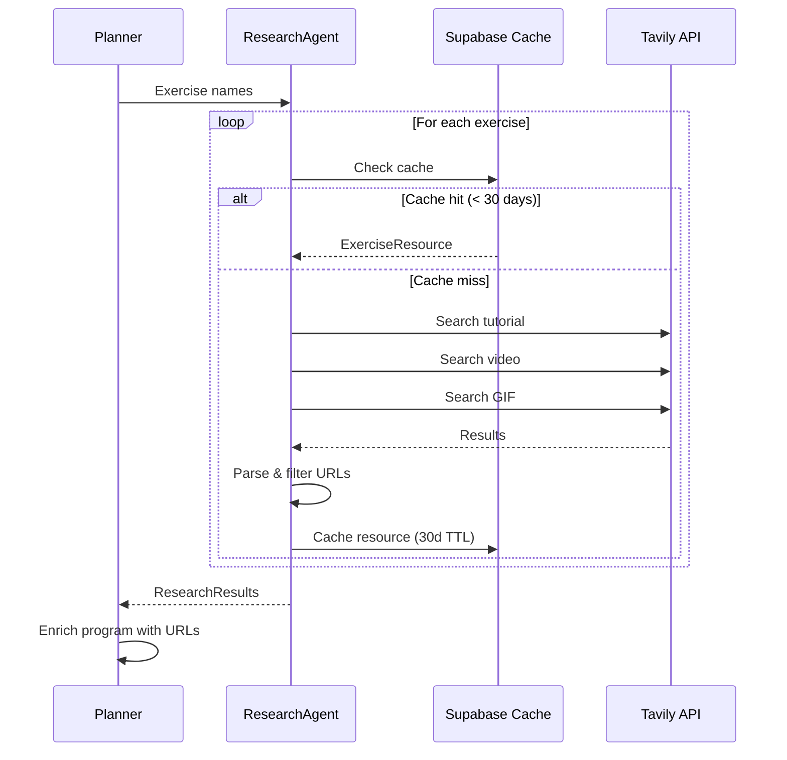

### 4.3 Nutrition Agent Sequence

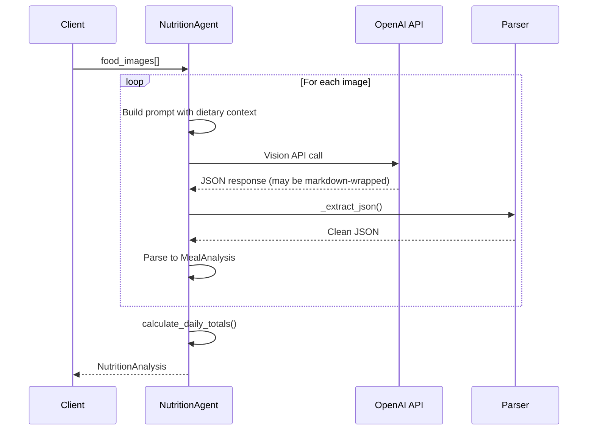

### 4.3 Planner Agent Algorithm

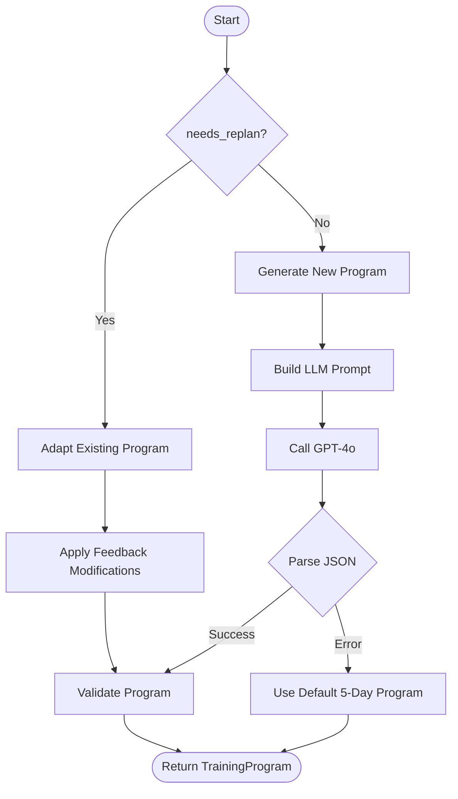

---

## 5. Graph Topology

### 5.1 LangGraph Structure

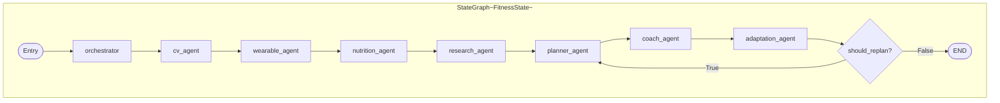

### 5.2 Graph Construction Code

```python
def create_fitness_graph() -> StateGraph:
    graph = StateGraph(FitnessState)

    # Add nodes
    graph.add_node("orchestrator", orchestrator_node)
    graph.add_node("cv_agent", cv_agent_node)
    graph.add_node("wearable_agent", wearable_agent_node)
    graph.add_node("nutrition_agent", nutrition_agent_node)
    graph.add_node("research_agent", research_agent_node)  # NEW
    graph.add_node("planner_agent", planner_agent_node)
    graph.add_node("coach_agent", coach_agent_node)
    graph.add_node("adaptation_agent", adaptation_agent_node)

    # Linear edges
    graph.add_edge("orchestrator", "cv_agent")
    graph.add_edge("cv_agent", "wearable_agent")
    graph.add_edge("wearable_agent", "nutrition_agent")
    graph.add_edge("nutrition_agent", "research_agent")  # NEW
    graph.add_edge("research_agent", "planner_agent")    # NEW
    graph.add_edge("planner_agent", "coach_agent")
    graph.add_edge("coach_agent", "adaptation_agent")

    # Conditional edge (feedback loop)
    graph.add_conditional_edges(
        "adaptation_agent",
        should_replan,
        {True: "planner_agent", False: END}
    )

    graph.set_entry_point("orchestrator")
    return graph
```

---

## 6. API Specifications

### 6.1 OpenAI Client Interface

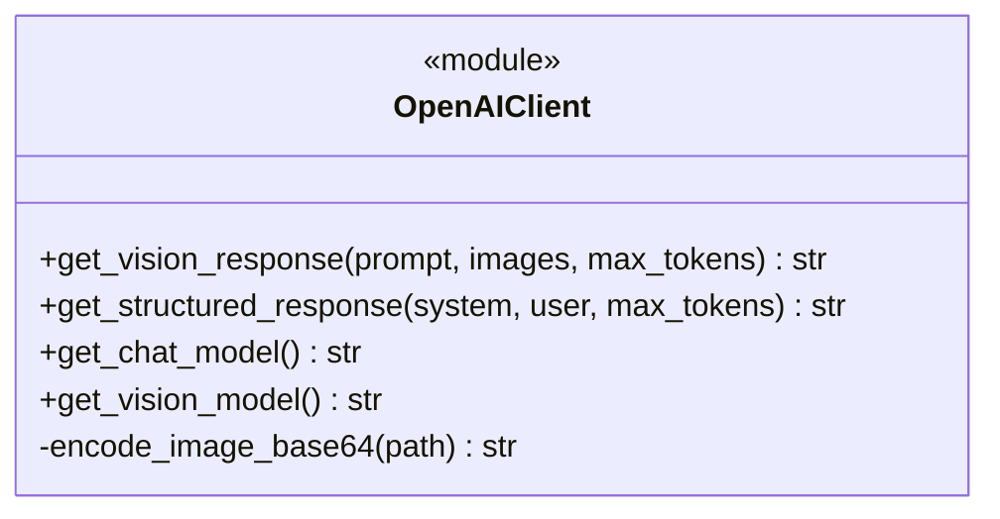

### 6.2 Request/Response Flow

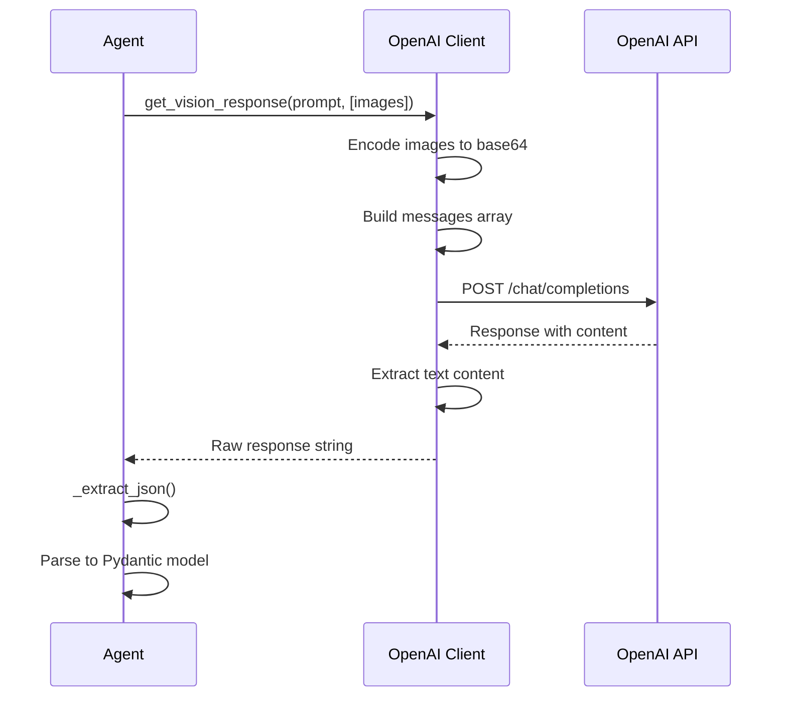

---

## 7. Safety Module

### 7.1 Validation Flow

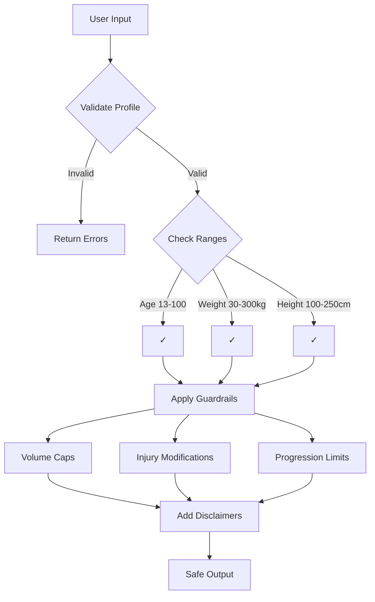

### 7.2 Guardrails Implementation

```python
class SafetyGuardrails:
    MAX_WEEKLY_SETS_PER_MUSCLE = 25
    MIN_REST_DAYS = 2
    MAX_PROGRESSION_PERCENT = 10

    INJURY_MODIFICATIONS = {
        "lower back": ["deadlift", "good morning"],
        "shoulder": ["overhead press", "upright row"],
        "knee": ["deep squat", "jumping"]
    }

    @staticmethod
    def apply_volume_cap(program: TrainingProgram) -> TrainingProgram:
        # Limit total sets per muscle group

    @staticmethod
    def apply_injury_modifications(
        program: TrainingProgram,
        injuries: list[str]
    ) -> TrainingProgram:
        # Substitute or remove risky exercises
```

---

## 8. Error Handling

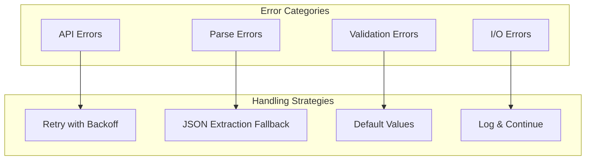

| Error              | Strategy                          | Fallback               |
| ------------------ | --------------------------------- | ---------------------- |
| OpenAI API timeout | Retry 3x with exponential backoff | Use default program    |
| JSON parse error   | Try markdown extraction patterns  | Log warning, skip item |
| Invalid profile    | Return validation errors          | Block execution        |
| Image not found    | Log warning                       | Skip image             |

---

## 9. Testing Strategy

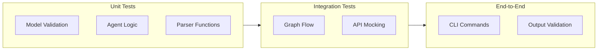

---

## 10. File Structure

```
src/
├── main.py                 # CLI entry, interactive mode
├── graph.py                # LangGraph StateGraph construction
├── state.py                # FitnessState TypedDict
├── agents/
│   ├── __init__.py
│   ├── orchestrator.py     # Input validation, routing
│   ├── cv_agent.py         # Video frame analysis
│   ├── wearable_agent.py   # Device data interpretation
│   ├── nutrition_agent.py  # Food image → macros
│   ├── research_agent.py   # Exercise resource search (Tavily)
│   ├── planner_agent.py    # 5-day program generation
│   ├── coach_agent.py      # Motivational messaging
│   └── adaptation_agent.py # Feedback loop logic
├── models/
│   ├── user_profile.py     # UserProfile, Goals, Preferences
│   ├── assessment.py       # MovementAssessment
│   ├── wearables.py        # WearableMetrics
│   ├── nutrition.py        # FoodItem, MealAnalysis
│   ├── program.py          # TrainingProgram, Exercise
│   ├── research.py         # ExerciseResource, ResearchResults
│   ├── session.py          # WorkoutSession, SessionSummary
│   └── feedback.py         # WeeklyFeedback
├── memory/
│   ├── user_memory.py      # Supabase integration
│   ├── session_cache.py    # In-memory session state
│   └── persistence.py      # SQLite storage
├── safety/
│   ├── validators.py       # Input validation functions
│   ├── guardrails.py       # Training safety limits
│   └── disclaimers.py      # Health warning generation
└── utils/
    ├── openai_client.py    # API wrapper functions
    └── prompts.py          # Agent prompt templates
```

---

## 11. References

- [HLD.md](HLD.md) - High-Level Design
- [README.md](../README.md) - User Guide
